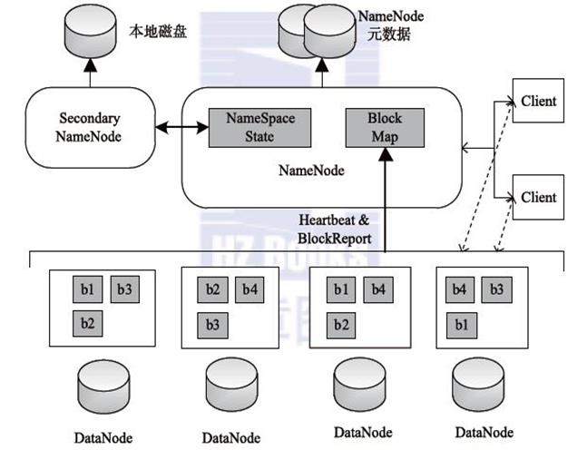
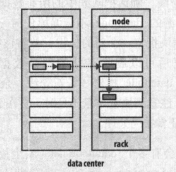
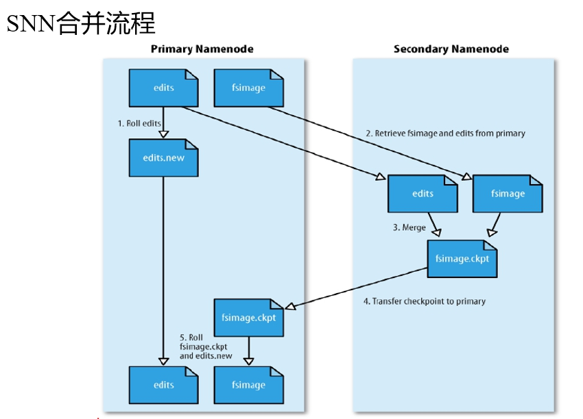
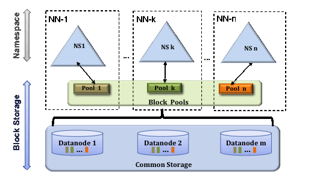
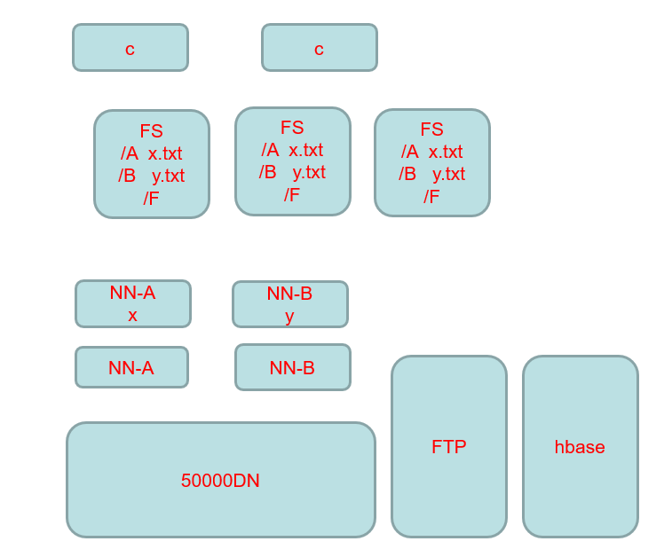
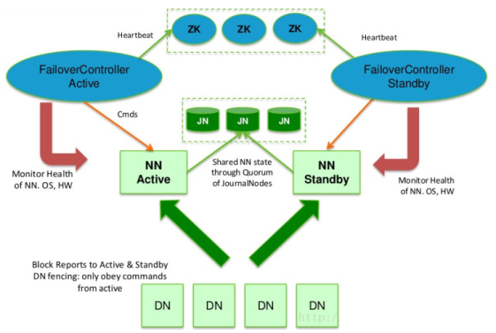
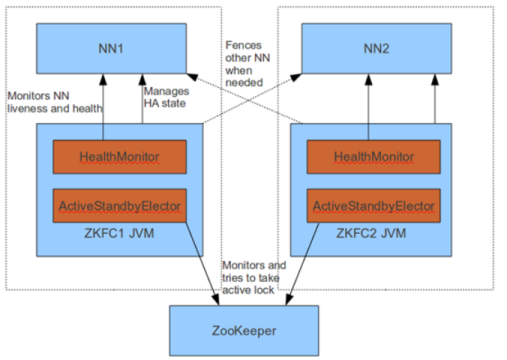
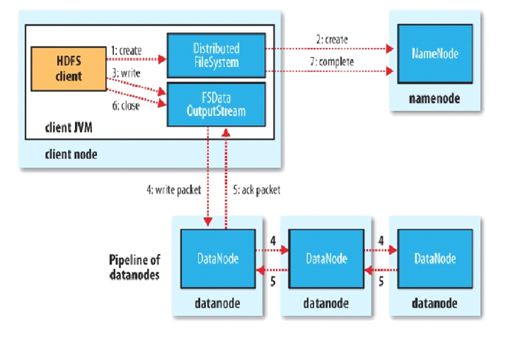
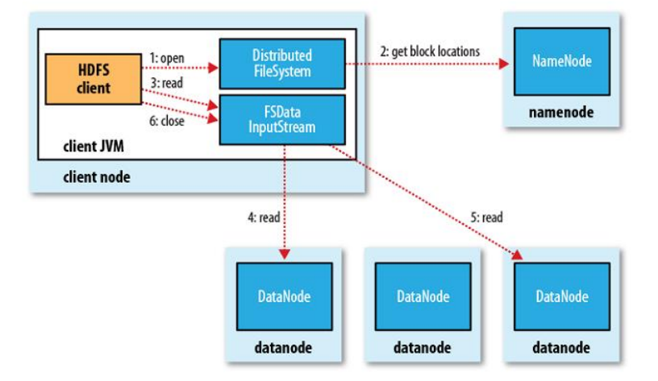
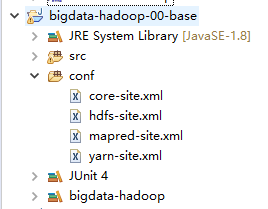

# Hadoop 分布式文件系统 HDFS

[TOC]

# 1. 概述

当要存储的文件超过单台计算机所能存储的容量时，就需要通过分区，将文件拆分后保存到若干台计算机上，管理网络中跨多台计算机的文件系统成为分布式文件系统。

Hadoop提供了一个称为HDFS的分布式文件系统（Hadoop Distributed Filesystem）。HDFS提供了高可靠性、高扩展性和高吞吐率的数据存储服务。


**HDFS优点**

1. 高容错性

   - 数据自动保存多个副本。它通过增加副本的形式，提高容错性。

   - 一个副本丢失以后，它可以自动恢复，这是由 HDFS 内部机制实现的，我们不必关心。

2. 适合批处理

   - 它是通过移动计算而不是移动数据。

   - 它会把数据位置暴露给计算框架。

3. 适合大数据处理

   - 处理数据达到 GB、TB、甚至PB级别的数据。
   - 能够处理百万规模以上的文件数量，数量相当之大。
   - 能够处理10K节点的规模。

4. 流式文件访问

   - 一次写入，多次读取。文件一旦写入不能修改，只能追加。

   - 它能保证数据的一致性。

5. 可构建在廉价机器上

   - 它通过多副本机制，提高可靠性。

   - 它提供了容错和恢复机制。比如某一个副本丢失，可以通过其它副本来恢复。


**HDFS缺点**


# 2. HDFS概念

## 2.0 HDFS 架构图




## 2.1 数据块（block）

每个磁盘都有默认的数据块大小，数据块（block）是磁盘用于读取数据的最小单位。

1. HDFS中也有数据块（block）的概念，HDFS中默认数据块的大小为128M，当我们要保存一个文件到HDFS时，HDFS会将文件按照数据块的大小线性切割分散的保存到集群的节点中。
2. 文件上传可以设置保存的数据块大小，同一个文件数据块的大小一样，不同文件的数据块大小可以不同。

3. HDFS可以设置数据块的副本数，数据块的副本分散存储在不同的集群节点中。

   ```tex
   默认副本放置规则：
   	- 副本1：放置在与客户端相同的节点上。
   	- 副本2：不同机架的节点上
   	- 副本3：与副本2相同机架的不同节点上
   	- 其他副本：随机挑选
   ```




4. HDFS支持一次写入多次读取，同一时刻只能有一个写入者。

5. HDFS是定制的文件系统，支持写入数据，追加数据（append），文件一旦写入不支持修改。


## 2.2 namenode 与 datanode

HDFS集群中有两类节点以`管理节点-工作节点`模式运行，即一个namenode（管理节点）和多个datanode（工作节点）。

### 2.2.1 NameNode

NameNode管理文件系统的命名空间。

NameNode维护着文件系统树以及整棵树所有的文件和目录，这些信息以两个文件形式永久保存在本地磁盘上：命名空间文件镜像文件和编辑日志文件。

NameNode记录着每个文件中各个块的元数据（包括文件大小，创建时间，文件名…），但是NameNode并不保存数据块的位置信息，NameNode中关于数据块位置信息通过与DataNode的心跳实时获取更新。


### 2.2.2 DataNode

DataNode是文件系统的工作节点，用于保存文件块（block）数据。

DataNode会根据需要存储并检索数据块（受客户端和NameNode调度），通过心跳定期向NameNode汇报数据块列表。


### 2.2.3 HDFS Client

Client用于通过与NN与DNN的交互来访问整个文件系统。Client通过HDFS提供的文件系统接口可以不用知道NN和DNN就可以进行数据交互。


### 2.2.4 HDFS故障处理

HDFS中存在单点故障和内存受限问题。

**NameNode备份**。

在HDFS中如果NN出现故障，则整个HDFS就会陷入瘫痪。因为NN中存储着整个HDFS中所有数据块的元数据，如果NN故障我们就不知道应该怎样通过DNN内的数据块重建文件。

备份机制：

1. 备份元数据，通过配置NameNode在多个文件系统上保存元数据的持久状态。一般是在元数据写入磁盘的同时，写入一个远程挂载的网络文件系统（NFS）。
2. 增加一个辅助NameNode（又称为：SecondaryNameNode（SNN）），这个辅助NameNode主要用于合并编辑日志（edits）与命名空间镜像（fsimage），可以防止编辑日志过大，导致NameNode重启缓慢。

SNN执行合并时机：

- 根据配置文件设置的时间间隔fs.checkpoint.period  默认3600秒

- 根据配置文件设置edits log大小 fs.checkpoint.size 规定edits文件的最大值默认是64MB  



**DataNode备份。**

DN通过向NN发送心跳保持与其联系（3秒一次），如果NN10分钟没有收到DN的心跳，则认为其已经挂掉，并拷贝其上的数据块（block）到其它DN。


### 2.2.5 HDFS 安全模式

- namenode启动的时候，首先将映像文件(fsimage)载入内存，并执行编辑日志(edits)中的各项操作。
- 一旦在内存中成功建立文件系统元数据的映射，则创建一个新的fsimage文件(这个操作不需要SecondaryNameNode)和一个空的编辑日志。
- 此刻namenode运行在安全模式。即namenode的文件系统对于客服端来说是只读的。(显示目录，显示文件内容等。写、删除、重命名都会失败)。
- 在此阶段Namenode收集各个datanode的报告，当数据块达到最小副本数以上时，会被认为是“安全”的， 在一定比例（可设置）的数据块被确定为“安全”后，再过若干时间，安全模式结束。
- 当检测到副本数不足的数据块时，该块会被复制直到达到最小副本数，系统中数据块的位置并不是由namenode维护的，而是以块列表形式存储在datanode中。


> #### 什么是元数据?
>
> 任何文件系统中的数据分为数据和元数据。数据是指普通文件中的实际数据，而元数据指用来描述一个文件的特征的系统数据，诸如访问权限、文件拥有者以及文件数据块的分布信息(inode...)等等。在集群文件系统中，分布信息包括文件在磁盘上的位置以及磁盘在集群中的位置。用户需要操作一个文件必须首先得到它的元数据，才能定位到文件的位置并且得到文件的内容或相关属性。


## 2.3 联邦HDFS（HDFS Federation）

‘

NN在内存中保存有目录树以及元数据信息。对于拥有大量文件的超大集群来说，内存将会成为限制系统横向扩展的瓶颈。在Hadoop 2.x版本中通过引入联邦HDFS对NN进行扩展，其中每个NN管理命名空间的一部分，保存着其中一部分文件信息。所有NN共享所有DataNode存储资源。



## 2.4 HDFS HA



在HDFS HA中配置了主备NN（Active-Standby），当活动的NN失效，备用的NN就会接管处理客户端的请求，不会产生任何明显的中断。

在HA中：主备NN之间需要通过高可用共享存储（NFS过滤器或群体日志管理器QJM）实现编辑日志的共享，当备用NN接管后，它将通过编辑日志实现与活动NN的同步。DataNode需要同时向主备NN发送数据块列表信息。

QJM用于提供高可用的编辑日志（edits），它以一组日志节点journal节点（JN）的形式运行。

在HDFS系统中有一个称为故障转移的控制器（Failover Controller）的组件，其管理着NN主备切换。NN故障切换有两种方式：手动切换，自动切换

- 手动切换：通过命令实现主备之间的切换，可以用HDFS升级等场合

- 自动切换：基于Zookeeper实现（NN中运行着的一个轻量级故障转移控制器，通过与Zookeeper的心跳判断NN是否故障，并进行故障切换）。




FailoverController主要包括三个组件:

1. HealthMonitor: 监控NameNode是否处于unavailable或unhealthy状态。当前通过RPC调用NN相应的方法完成。
2. ActiveStandbyElector: 管理和监控自己在ZK中的状态。
3. ZKFailoverController 它订阅HealthMonitor 和ActiveStandbyElector 的事件，并管理NN的状态。


> #### 基于Zookeeper自动切换方案
>
> 1. ZooKeeper Failover Controller：通过心跳监控NameNode健康状态，
>
> 2. 向Zookeeper注册NameNode
>
> 3. NameNode挂掉后，ZKFC为NameNode竞争锁，获得ZKFC 锁的NameNode变为active


# 3. HDFS 写入数据



具体步骤：

1. 通过DistributedFileSystem对象调用create()来创建文件。
2. DistributedFileSystem对NN创建一个RPC调用，在文件命名空间创建一个文件，HN会执行检查确保命名空间中没有相应数据块。
3. 通过返回的FSDataOutputStream对象写入数据，在写入数据时通过FSDataOutputStream封装的DFSoutPutStream将数据块分割成更小的数据包，将其写入数据队列（Pipeline）中。
4. DataStreamer会将写入数据队列的数据包以流式传输的方式传输到第一个节点，第一个节点传输完毕后会将数据包向后拷贝到第二个节点，然后第二个节点拷贝到第三个节点。
5. 当数据包传输完毕后通过DFSOutputStream维护的内部数据包队列（ack package）来确认是否传输成功，只有收到管道中所有DN的确认信息后该数据包才会从确认队列中删除。
6. 客户端完成数据的写入后，调用close方法关闭连接。
7. 通告NN，等待NN确认文件写入。


# 4. HDFS 读取数据



具体步骤：

1. 客户端通过调用FileSyste的open（）方法来打开希望读取的文件，该对象是DistributedFileSystem的实例。
2. DistributedFileSystem通过远程调用（RPC）调用NN，确定文件起始块位置。对于每个块NN返回存有该块副本的DN地址，这些返回的DN会根据与客户端的距离进行排序。
3. 通过DistributedFileSystem返回的FSDataInputStream封装的DFSInputStream对象的read（）方法读取数据。
4. 通过反复调用read（）方法可以将数据从DN传输到客户端。
5. 读取到达块的末端时，DFSInputStream关闭与DN的连接，然后寻找下一个最佳的DN，继续read（）读取数据。
6. 调用close方法关闭流。


# 3. HDFS常用命令

1. 列出HDFS下的文件

```shell
hadoop dfs -ls
```

2. 列出path目录下的文件

```shell
hadoop dfs -ls path
```

3. 上传data.txt文件到/path目录下

```shell
hadoop dfs -put /data.txt /path
```

4. 下载HDFS 内/data.txt文件到本地/path目录

```shell
hadoop dfs -get /data.txt /path
```

5. 删除HDFS内 /data.txt 文件

```shell
hadoop dfs -rmr /data.txt
```

6. 查看/data/TianQi.txt文件内容

```shell
hadoop dfs -cat /data/TianQi.txt
```

7. 建立目录

```shell
hadoop dfs -mkdir /path
```


# 4. HDFS Java接口

Demo结构：



测试代码：

```java
public class Demo {
	
	private Configuration conf = null;
	private FileSystem fs = null;
	
	@Before
	public void conn() throws Exception {
		conf = new Configuration(true);
		fs = FileSystem.get(conf);
	}
	
	@After
	public void close() throws Exception {
		fs.close();
	}
	
	/**
	 * 创建目录
	 */
	@Test
	public void mkdirTest() throws Exception {
		Path path = new Path("/data");
		if(fs.exists(path)) {
			fs.delete(path, true);
		}else {			
			fs.mkdirs(path);
		}
	}
	
	/**
	 * 上传文件
	 */
	@Test
	public void uploadTest() throws Exception {
		InputStream inputStream = new FileInputStream(new File("C:\\Users\\LGX\\Desktop\\TianQi.txt"));
		Path f = new Path("/data/TianQi.txt");
		FSDataOutputStream dataOutputStream = fs.create(f);
		IOUtils.copyBytes(inputStream, dataOutputStream, conf, true);
		System.out.println("upload OK...");
	}
	
	/**
	 * 读取文件
	 */
	@Test
	public void readTest() throws Exception {
		InputStream is = fs.open(new Path("/data/TianQi.txt"));
		IOUtils.copyBytes(is, System.out, conf);
		System.out.println("ok...");
	}
	
	/**
	 * 获取文件状态信息
	 */
	@Test
	public void statusTest() throws Exception {
		FileStatus status = fs.getFileStatus(new Path("/data/TianQi.txt"));
		
		Path path = status.getPath();
		System.out.println(path);
		
		String group = status.getGroup();
		System.out.println(group);
		
		long len = status.getLen();
		System.out.println(len);
	}
	
	/**
	 * 列出文件
	 */
	@Test
	public void listStatusTest() throws Exception {
		//获取目录下所有文件状态
		FileStatus[] listStatus = fs.listStatus(new Path("/data"));
		for (FileStatus fileStatus : listStatus) {
			Path path = fileStatus.getPath();
			System.out.println(path);
		}
	}
}
```